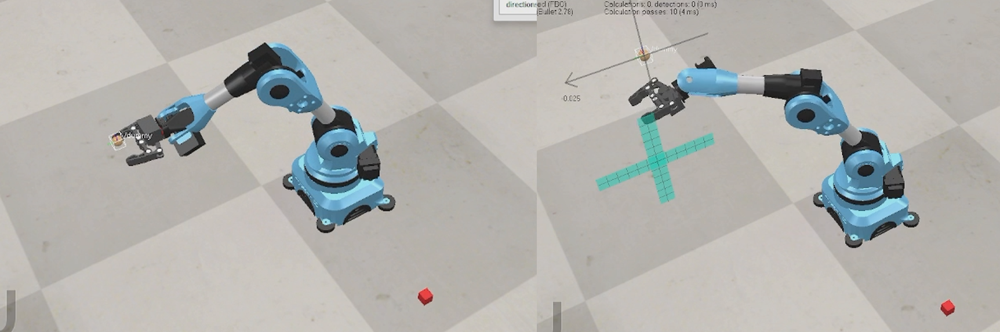

# Niryo-One — Forward & Inverse Kinematics (MATLAB + CoppeliaSim)


## Project description
Analytic forward- and inverse-kinematics demo for a 6-DOF Niryo-One robot:
- Analytical IK (decoupled position then orientation).
- Produces multiple IK branches (elbow up/down, wrist flips).
- Validates and selects best IK candidate using FK-based error metric.
- Demonstration uses MATLAB <-> CoppeliaSim remote API for simulation control.

## Requirements
- MATLAB (R2019a or newer recommended).
- CoppeliaSim (use same major version used to create the `.ttt` scene).
- MATLAB Remote API for CoppeliaSim (legacy `simx` API or appropriate API for your CoppeliaSim version).
- Basic linear algebra: rotation matrices, `atan2`, vector norms.
- Local network access (loopback `127.0.0.1`) or configured IP/port between MATLAB and CoppeliaSim.

## Installation / preparation
1. Clone repository.
2. Put `matlab/` and `coppeliasim/` folders in repository root.
3. Open `coppeliasim/Niryo-One robot simulation environment.ttt` in CoppeliaSim and confirm joint objects and a dummy target exist.
4. Add MATLAB folder to path:
   ```matlab
   addpath('path/to/repo/matlab');
